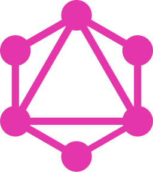
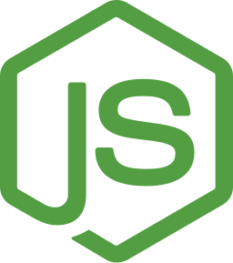

### Hi, I'm Charlie! 👋

 

I'm currently a **Software Development Team Lead** at
<a href="https://www.mappedin.com/">Mappedin</a>, where I'm leading a team building out an awesome full-stack application.

 

Here are some languages and libraries that I like to work with:

<table style="width:60%;border:none;">
<tr>
    <td>
        
            
             
            <strong>TypeScript</strong>
        
    </td>
    <td>
        
            
             
            <strong>React</strong>
        
    </td>
</tr>
<tr>
    <td>
        
            
             
            <strong>Jest</strong>
        
    </td>
    <td>
        
            
             
            <strong>Testing Library</strong>
        
    </td>
</tr>
<tr>
    <td>
        
            
             
            <strong>GraphQL</strong>
        
    </td>
    <td>
        
            <strong>Express</strong>
        
    </td>
</tr>
<tr>
    <td>
        
            
             
            <strong>Node</strong>
        
    </td>
    <td>
        
            
            <strong>MongoDB</strong>
        
    </td>
</tr>
<tr>
    <td>
        
            
             
            <strong>PostgreSQL</strong>
        
    </td>
</tr>
</table>

 

Feel free to reach me at any of my social links:

    
       
    
       
    

